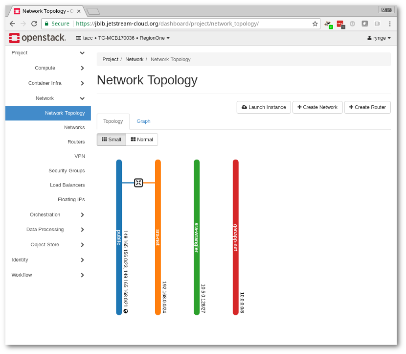

# jetstream-sra-cluster

This module sets up an autoscaled Jetstream cluster for SRA work, based
on HTCondor, the OpenStack Shade library, and SaltStack.

## Prerequisites 

In the Jetstream web interface (API version), make sure you have a network
called "sra-net" with a router configured to access the public network.
Under the network topology tab, you should see something like:

Create a new instance with a name something like "master". The exact
name is not important, but keep it descriptive as you do not want to
have it confused with the autoscaled instances later on.

The base OS should be CentOS 7. One of the Jetstream provided
_Centos 7 Development_ or _Centos 7 (7.4) Development GUI_ images should
do fine. Once booted, install a few base packages and Python modules:

    $ yum install -y python-devel
    $ pip install shade

Also make sure the hostname is correctly set. This is something 
Jetstream/Cloudinit screws up some of the time. Verify that forward
and reverse DNS works for the hostname:

    $ hostname -f
    sra-master-2.jetstreamlocal
    $ host sra-master-2.jetstreamlocal
    sra-master-2.jetstreamlocal has address 192.168.0.5

If the hostname is not set correctly, adjust it before continuing on.
Most of the time, it is just the domain part that needs to be updated 
(for example, switching from _.novalocal_ to _.jetstreamlocal_). 
Update the hostname with both the `hostname` command as well as
editing _/etc/hostname_

## Install

To install this module, clone it as root from git under */srv*

    $ cd /srv
    $ git clone git@github.com:rynge/jetstream-sra-cluster.git

## Configuration

Create a configuration file for Share (_/root/.config/openstack/clouds.yml_)

    clouds:
     jetstream_iu:
       region_name: RegionOne
       auth:
         username: '[username]'
         password: '[password]'
         user_domain_name: 'tacc'
         project_id: '24a999541c0c40fd9ab7c5cee556fb40'
         project_name: 'TG-MCB170036'
         auth_url: 'https://iu.jetstream-cloud.org:5000/v3'

Then bootstrap the instance as a master instance, using the hostname
from the first step:

    $ cd /srv/jetstream-sra-cluster
    $ ./bootstrap-master sra-master-2.jetstreamlocal

## Snapshots

The autoscaler searches your private images for the pattern 
_sra-base-*_ and uses the last image it can find. It is recommended
that you take a snapshot, and names it after the date in YYYYMMDD format,
for example: _sra-base-20171127_

Before taking the snapshot, run the `jetstream-prep-for-imaging` command
which will clean the image of credentials and configuration. Once the
system is up and running, you can snapshot workers to prevent the 
destructive image preparation affecting your master instance.

## Monitoring

See _/var/log/sra-autoscaler.log_ for the last run of the autoscaler.

